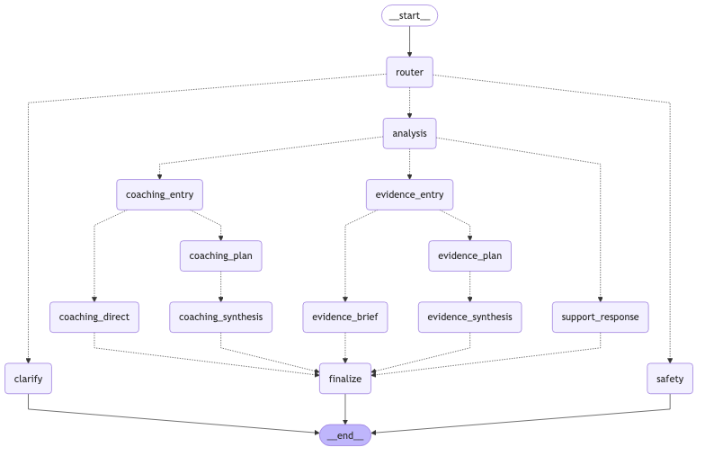

## Mellow Router

Minimal LangGraph chatbot with difficulty-based routing and memory.

### Setup

1. Install dependencies (use uv or pip):

```bash
uv sync
# or
pip install -e .
# dev extras for tests
pip install -e .[dev]
```

2. Set your OpenAI key:

```bash
export OPENAI_API_KEY=sk-...
# optional: use a .env file (auto-loaded)
echo 'OPENAI_API_KEY=sk-...' > .env
```

### Run (with memory)

```bash
python main.py "Summarize this paragraph in one sentence" --thread user-123
python main.py "Explain and implement Dijkstra's algorithm" --thread user-123
python main.py "Design a distributed consensus protocol variant" --thread user-123
```

### Save the graph as PNG

- Uses `mmdc` if available, otherwise falls back to the Kroki API.



```bash
# optional local renderer (recommended)
npm i -g @mermaid-js/mermaid-cli

python main.py --save-graph graph.png
python main.py --save-graph graph.png --graph-theme dark
```

### Tests

```bash
pytest
```

### How it works

- **State**: `messages: Annotated[list[AnyMessage], add_messages]`, `route: str`.
- **Router**: Uses structured output (`pydantic` model `DifficultyResult`) with `ChatOpenAI` to classify the last user message as `low`, `medium`, or `high`.
- **Models**: Routes to handlers backed by:
  - `low` → `gpt-5-nano`
  - `medium` → `gpt-5-mini`
  - `high` → `gpt-5`
- **Memory**: `MemorySaver` checkpointer; pass `--thread <id>` to persist context across turns.


