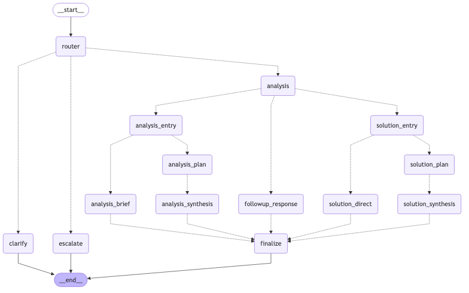

## Mellow Router


Layered routing assistant that triages each request, chooses a specialty workflow, and keeps a running memory of the conversation.

### Setup

1. Install dependencies (use `uv` for speed or fall back to `pip`):

   ```bash
   uv sync
   # or
   pip install -e .
   pip install -e .[dev]  # optional test extras
   ```

2. Provide your OpenAI API key (environment variable or `.env` file is fine):

   ```bash
   export OPENAI_API_KEY=sk-...
   echo 'OPENAI_API_KEY=sk-...' > .env
   ```

### Run it

Streams the assistant’s replies by node so you can watch the routing in real time.

```bash
uv run python main.py "Summarize this paragraph in one sentence" --thread user-123
uv run python main.py "Explain the backpropagation algorithm" --thread user-123
uv run python main.py "Coach me through preparing for a tough conversation" --thread user-123
```

`--thread` pins the memory checkpoint so follow-up turns reuse context.

### Visualize the flow

`main.py --save-graph` exports the compiled state machine to Mermaid/PNG. The script prefers `mmdc`; otherwise it falls back to Kroki.



```bash
# optional local renderer
npm i -g @mermaid-js/mermaid-cli

uv run python main.py --save-graph graph.png
uv run python main.py --save-graph graph.png --graph-theme dark
```

### Architecture at a glance

- **State** stores the running messages plus routing signals (`difficulty`, `clarity`, `intent`, `priority`, `notes`).
- **Classifier** produces those signals via structured output and sends the request to one of three top-level branches: clarification, human escalation, or deeper analysis.
- **Analysis layer** splits into follow-up, solution, or explanation tracks. Each track can plan, synthesize, and hand off to a common finalizer.
- **Finalizer** consolidates prior responses, reinforces next steps, and highlights any follow-up flags.
- **Memory** relies on a checkpoint store so each `thread` ID keeps its own history.

### Using the router to build a fine-tuning dataset

1. **Log triage metadata** – instrument `router` to capture the structured output (`difficulty`, `clarity`, `intent`, `priority`) alongside the incoming user message.
2. **Capture target node** – record the node that ultimately responds (e.g., `analysis_brief`, `solution_synthesis`) and the model ID associated with it.
3. **Collect examples** – run representative prompts through `main.py` (or call `build_app()` inside your own harness) and store tuples of `(input_message, triage_metadata, chosen_node/model)`.
4. **Fine-tune your classifier** – train a lightweight model on the synthetic dataset to map raw user inputs to the desired routing outputs. The current prompt-driven classifier gives you synthetic labels to bootstrap that process.

In production, swap the prompt-based triage step with your trained classifier while keeping the downstream node graph unchanged.

### Tests

```bash
uv run pytest
```
